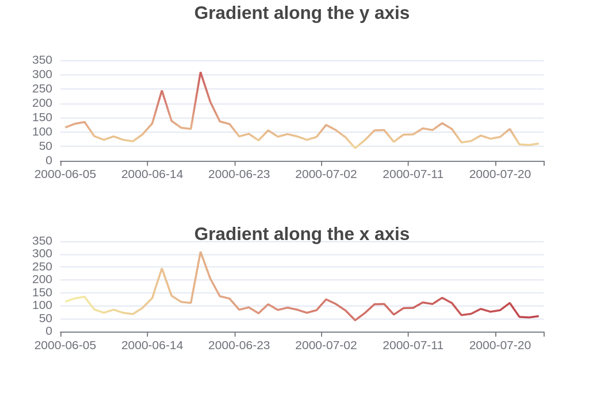

# wasm_plot

## source
forked from gallery and examples of charming

* charming
https://github.com/yuankunzhang/charming

* leptos
https://github.com/leptos-rs/leptos

## run 
 
* install wasm runtime 
more,please check leptos 
```sh
rustup target add wasm32-unknown-unknown
cargo install trunk
```
* run
```sh
trunk serve
```
## goal

* plot data to web(charming)
* full stack(leptos)
TODO:
* add zeromq,mqtt realtime data
* realtime plot line and scatter
## example show
